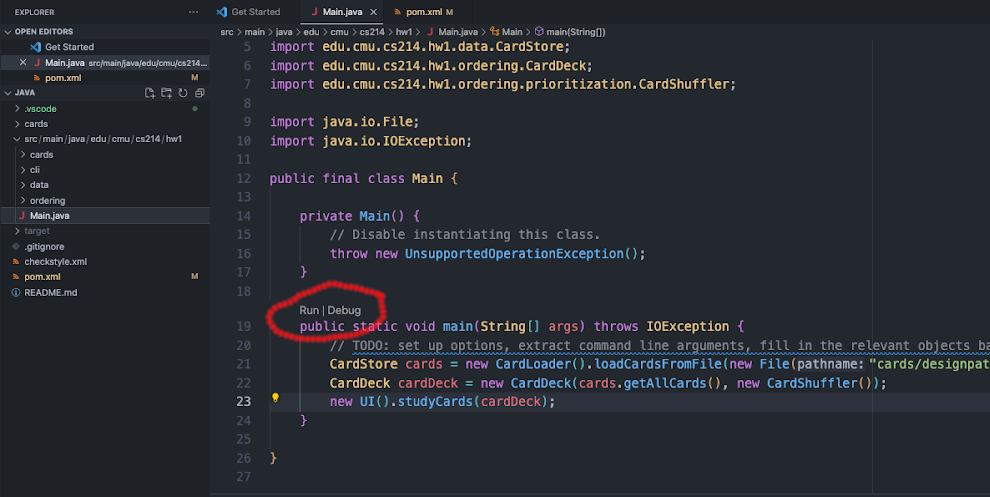
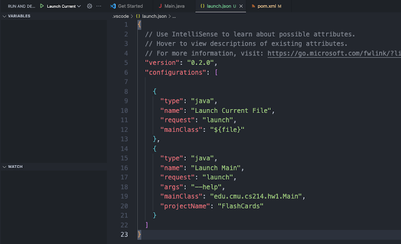

# Lab 1: Course Infrastructure Setup

During this course, you will become familiar with several popular and industry-relevant software engineering tools, including IDEs, build systems, and automated style checkers. In this lab, you will set up your environment and explore some tools for getting started with Java. The instructions are unusually long, because we try to provide more detailed help for common problems. If you encounter problems along the way, look back at the instructions, work through problems with others, and seek help from the TAs during the lab session. 


## Deliverables

- [ ] Locally clone your Homework 1 Git repository, fix a typo in the `README.md` file ("assigment" -> "assignment") and commit and push the change.
- [ ] Install Java 21, Maven, and an IDE of your choice. Run `java --version` to verify it is version 21.
- [ ] Show that you can compile and run the Java starter code of homework 1 on your machine.


## Setting Up Your Repo 

In this lab, we will work with the starter code from Homework 1. Each student in 17-214/514 is assigned a GitHub repo per homework assignment. You can create it by following the GitHub Classroom link in the description of [Homework 1 on Canvas](https://canvas.cmu.edu/courses/39213/assignments/675175).

- If you do not have *git* yet, follow the [download instructions](https://git-scm.com/downloads).
- If you do not have a *GitHub* account yet, [create one](https://github.com/). 
- Follow the GitHub classroom link on Canvas/Piazza to create your own GitHub repository with the starter code for homework 1.

**Setting up your Personal Access Token.** Before cloning the repository, you should set up your own personal access token; otherwise, you might get an invalid username or password error. GitHub removes these every year, so even if you have made one in the past, you may need to recreate it. You can follow the [instructions](https://docs.github.com/en/authentication/keeping-your-account-and-data-secure/creating-a-personal-access-token) for the general outline on how and where to create a personal access token. Some things to note: 

- You can name it something like 17214s24 or whatever you’d like 
- Set the expiration date to be some time past the end of the semester (e.g. 05/31/24), so that you don’t have to remake it again this semester 
- You can select all of the options if you’d like and read more about what they do [here](https://docs.github.com/en/developers/apps/building-oauth-apps/scopes-for-oauth-apps). At the very least, make sure you have the **repo, workflow, user, project** scopes selected. 
- **Important:** Once you generate the token, make sure you save it somewhere safe and accessible to you before you leave the page. You will need to use it as your password to log-in and you won’t be able to see it again after leaving the page. 

**Cloning the Repository.** Navigate to your own remote repository, and then click on the green “code” button to copy the URL of this remote repository so that you can clone it. 

We recommend to learn to use *git* on the command line, but you can also the integration in your IDE or [GitHub Desktop](https://desktop.github.com/). To clone the repository from the command line run the following in a terminal: `git clone <The URL of the remote repository>`

This will download the entire repository to your computer. If you are prompted to input your username and password, make sure that you use your personal access token you created above as the password. 


## Java Setup

### Installing Java 

Download and install Java 21. The language used in this class is Java 21. Several vendors provide implementations of Java 21, if in doubt choose the open-source OpenJDK 21. 

Installing the right version of Java can sometimes be a bit tricky. If you already use a package manager for your platform (homebrew, apt, snap, scoop, etc) installing Java with that tool is probably the easiest. Below are detailed instructions, but feel free to skim/skip.

*Note for Windows users:* We recommend installing [WSL](https://learn.microsoft.com/en-us/windows/wsl/install) (Windows Subsystem for Linux) and using it for all your development environments installations and future assignments when following this guide. 

**Installing Java using homebrew on MacOS.** Run `brew install openjdk@21` and run the command from the output to create a symbolic link. See [these instructions](https://medium.com/@manvendrapsingh/installing-many-jdk-versions-on-macos-dfc177bc8c2b) for a detailed reference.

**Manual installation and other operating systems.** 

- MacOS. Download the MacOS tar.gz archive from the [OpenJDK website](https://jdk.java.net/archive/). Untar the archive (double click), and move the contained directory (named something like jdk-21.0.1.jdk) to the /Library/Java/JavaVirtualMachines/ directory
- Linux. If possible, please really use the package manager of your distribution. It will be much easier. Instructions for a manual installation on Ubuntu can be found [here](https://computingforgeeks.com/install-java-jdk-21-openjdk-21-on-ubuntu/).
- Windows. To install OpenJDK, download the Windows zip file from the [OpenJDK website](https://jdk.java.net/java-se-ri/21), and follow the instructions at [this StackOverflow post ](https://stackoverflow.com/questions/52511778/how-to-install-openjdk-11-on-windows/52531093#52531093)to correctly set Windows environment variables. Alternatively, if you wish to just use an install wizard, [download and install the Oracle JDK](https://www.oracle.com/java/technologies/downloads/#java21).

**Managing multiple Java installations.** If you already have existing different versions of Java installed and want to keep them, you can use [jEnv](http://jenv.be) to help manage your installations. As another option, you can set the JAVA_HOME environment variable in your ~/.zshrc or ~/.bash_profile or Windows configuration to point to Java 21 folder (e.g., `export JAVA_HOME=$(/usr/libexec/java_home -v21)`; if you choose this approach, you’ll need to modify the number that comes after -v if you ever want to switch your Java version). If you’re interested in switching between Java versions (not needed in this course), see [here](https://medium.com/@manvendrapsingh/installing-many-jdk-versions-on-macos-dfc177bc8c2b) under the section “Switching JDKs” for instructions on how to do so. 

*Checkpoint:* Confirm your Java installation by inspecting the output of the command `java -version` and `javac -version`. You should see something similar to: *openjdk version "21.0.1" 2023-10-17.* The major version should be 21, any vendor and patch version is okay. 

### Installing Maven

We use Maven as the build tool and package manager for Java in this course. Install a recent version of Maven. You can follow the instructions in [this link](https://www.baeldung.com/install-maven-on-windows-linux-mac) and verify that Maven 3.8.7 or newer is installed.[^1] More information about Maven can be found [here](https://maven.apache.org/what-is-maven.html).

For Mac users, you might find it easiest to install maven using homebrew: `brew install maven`

Explore the `pom.xml` file to see how the project is currently configured.

*Checkpoint:* In the java subdirectory of your local homework 1 repository, try to run `mvn install` which will download dependencies and compile the code. You can either type `mvn install` in the terminal or click the Maven tab on the bottom left, scroll down to “install” and press the triangle.

### VSCode for Java

VSCode is a popular IDE for Java which we recommend for this course, but you are free to choose other IDEs, such as IntelliJ and Eclipse, which are more advanced if you are solely developing in Java. However, we will later introduce and develop in TypeScript in the course, so using VSCode will save you from having to switch between IDEs which can be tedious. 

Install VSCode following [instructions](https://code.visualstudio.com/) on its homepage or use your operating system's package manager.

*Checkpoint:* You can explore the source files of the cloned repository in the IDE.

**Navigate to the sidebar and look for the extensions symbol (5th from the top) and search for “Extension Pack for Java” and install it locally**. This extension includes linting, test running and debugging, support for Maven (the build automation tool we use for Java projects in this class), and a few other helpful extensions. 

You need to have Java 21 installed for this project. Do not downgrade your Java version if you are asked to, this will break your project. 

*Checkpoint:* You can explore the source files in the IDE.

**Running a Java program in VSCode.** Once you have successfully opened the project and installed Maven, you should be able to view all the starter source files. Try building the program and run the main class.




To run a program go to the main class (`Main.java`), you should see a *Run | Debug* prompt above the main method. Click *Run*. You will be able to view the run result at the bottom. You can interact with this program by replying on the console and hitting “enter”.

Alternatively, you can open the `Main.java` file and then open the *Run and Debug* tab on the left sidebar (4th from the top). Pressing Run and Debug will have the same effect as pressing Debug on the prompt above the main method. 

**Passing a command-line argument (you might find this helpful for HW1).** If you want to pass an argument to the program from within VSCode, click *“Create a launch.json file”*. This will open a file containing all of the run configurations. If you’d like to modify this in the future, you can find it in the .vscode folder. 



Under the configuration named `Launch Main`, you can add the attribute `args` and supply it with your arguments. For example `"args": "--help"`.  You can also supply multiple arguments in the same line: `"args": ["--arg1", "value1", "--arg2", "value2", …]`

For more information on launch configurations and Java debugging in VSCode, see [here](https://code.visualstudio.com/docs/editor/debugging#_launch-configurations).

### Checkstyle for Java

We preconfigured the project with the style checker *Checkstyle*. It is automatically executed as part of compiling and packaging the project with `mvn site (on the command line or in the IDE).

If you’d like to be able to run Checkstyle through VSCode’s UI, you can search for and install the [“Checkstyle for Java” extension](https://code.visualstudio.com/docs/java/java-linting#_checkstyle).  To use this extension: Right click the `checkstyle.xml` file and select *“Set the Checkstyle Configuration File”* . Then right click on the file you want to check and select *“Check Code with Checkstyle”*. You can view Checkstyle violations on the problems tab near your terminal. 

*Checkpoint*: Test Checkstyle by renaming one method to start with a capital letter (against Java's style guidelines) and it should complain. A neat thing that this plugin does is automatically lint your code as you write it. You can test this out by opening the “problems” tab and making further changes.


## Turning in Your Work

For finishing this lab (and all homeworks), you are required to submit your work by pushing changes to your repositories on GitHub. 

The minimal instructions to submit code with Git on the command line are:

````bash
git add <filename1> <filename2>
git commit -m "<some message>"
git push
````

**git add** adds files to the staging area, **git commit** saves everything on the staging area along with the given commit message, and **git push** records local commits to the remote repository. After pushing changes you should see them on GitHub.

If you are new to Git you will learn to better use it throughout the semester, including best practices and more advanced functionality like branches. We provide more detailed instructions in a [separate document](git-basics.md) but encourage you to find documentation and tutorials on your own too.


[^1]: If you choose to use the instructions linked, the `chown -R root:wheel Downloads/apache-maven*` command should actually be `sudo chown -R root:wheel Downloads/apache-maven*`. If you run into issues with adding Maven to your environment path, try using `~/.zshrc` instead of `~/.zshenv`.
