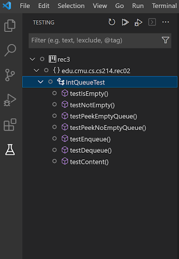
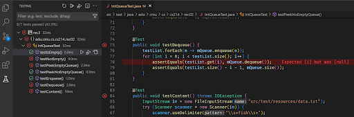
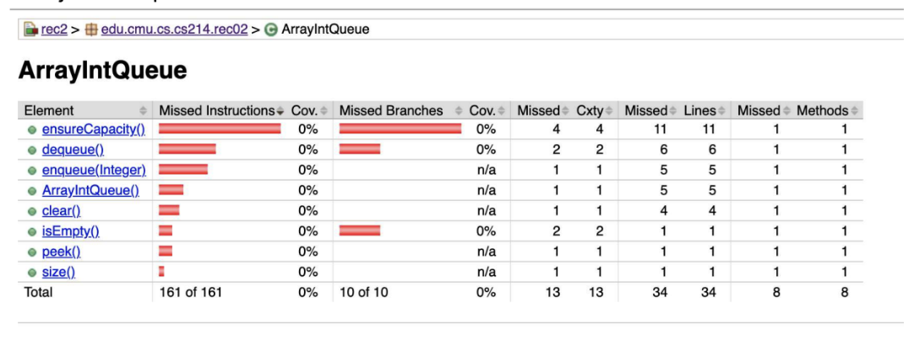

# Lab 3: Testing

In this lab you will get familiar with different testing strategies and practice with writing good unit tests in Java.

## Concepts
**Structural testing vs Specification testing:** Two distinct types of unit testing are specification-based (historically: black-box) testing and structural (white-box) testing. Specification testing is when you write high-level test cases against the specification of a program, without using (or testing) the specific underlying implementation of the program. In structural testing, your tests are instead tailored to the specific underlying implementation of the code you are testing.

**Code coverage:** Coverage is the amount of code that has been executed by the tests. There are several coverage metrics, but one common metric line coverage is simply the percentage of lines (or statements) that have been executed by your unit tests. 

## Deliverables

- [ ] Write tests for `LinkedIntQueue` in Java using specification testing,
execute them from within the IDE. Then use those tests to find bugs in `ArrayIntQueue` in Java. 
- [ ] Add more tests to achieve 100% line coverage for `ArrayIntQueue` and show coverage results in the IDE or as HTML report. 
- [ ] Describe your experience with the tradeoffs between structural testing and specification testing to the TA. (no written answer needed) 

## Instructions

### Setup
Fork and clone the repo from https://github.com/CMU-17-214/s24-lab03.
The code is set up with JUnit. You can use your IDE to open the folder of Java and run the existing test with the command in the readme.md. You can also see Appendix 1 for how to run tests in IDE. 

### Testing
For `LinkedIntQueue` use specification testing by refering to `IntQueue` specification in `IntQueue.java`.
Write additional tests in addtion to the code we've provided and execute them from within the IDE.

For `ArrayIntQueue` use structural testing. Specifically test underlying implementation of the `ArrayIntQueue` class, not just test against the `IntQueue` specification. 
1. Open Java folder with IDE. Run `IntQueueTest` class in the IDE (see readme.txt). Change the `mQueue` variable to `ArrayIntQueue` and run testing again. Use your IDE to see the line coverage result. See appendix 3 for coverage tooling. 
2. Try to find 2 bugs in `ArrayIntQueue` by running your test. Fix each bug that was found. 
3. Write more test cases to achieve 100% line coverage.

## Appendix 1: Test Integration in VSCode
The `Test Runner for Java` plugin in VSCode provide great test integration functionality. The testing side panel shows all the tests of the current project. You can also run all tests or a particular test here.

After running the test cases, the plugin also shows the failed test cases. Also, you can direct to the failed assertions, and VSCode can show the concrete reasons for the failures.

## Appendix 2: Test Directories For Java
By convention in Maven, test files are placed in a test folder with the path `src/test/java`. You may need to create this directory if it does not exist (useful for homework 2). In some IDEs you may need to indicate that this directory contains test files for the IDE to recognize and run the classes. In this directory create the same package structure as in `src/main/java` and place the test class in the same package as the class to be tested. 

## Appendix 3: Coverage Tools
In Java, we already set up the project to use Jacoco for collecting Coverage. If you run `mvn test` or `mvn site` to execute the tests, it will produce a report in `target/site/jacoco/index.html`. You can check the pom.xml file to see how we enabled this. Open with a browser to view the coverage report.

Your jacoco report should be similar to this when viewed in the browser.

In IntelliJ you can run tests with Coverage directly from within your IDE: Right click on test class and select **Run '$classname' with Coverage**; there should be a panel that pops up the right side of the screen showing class coverage.

