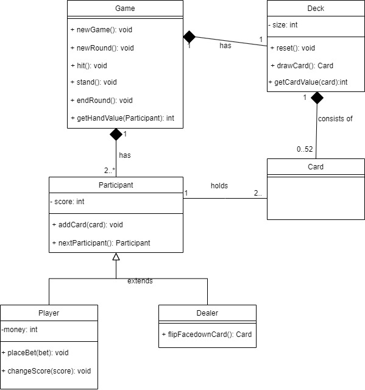

# Lab 4: Software Design and UML

During lecture, we discussed how we analyze problems, design solutions, and communicate them via UML diagrams. In this lab, you will practice creating UML diagrams for a hypothetical implementation of Blackjack. We encourage you to review the lecture notes, reference [UML and Patterns](https://cmu.primo.exlibrisgroup.com/discovery/fulldisplay?context=L&vid=01CMU_INST:01CMU&search_scope=MyInst_and_CI&tab=Everything&docid=alma991019576227704436) (Chapter 9-10, 14-15), and work with each other. You are free to draw the diagrams via paper and pencil, tablet, or whatever you choose as long as the diagrams are legible. We recommend [https://www.draw.io](https://www.draw.io).

## Deliverables

- [ ] Create a domain model for Blackjack as described below, and develop a system sequence diagram depicting a single player starting a new game and playing one round of Blackjack.
- [ ] Find and fix two problems with coupling/cohesion in the provided object model.
- [ ] Create an object-level interaction diagram for a player choosing to hit in a round of Blackjack, consistent with your fixed object model and system sequence diagram.

## Instructions

### Background
Suppose you are designing and implementing a simplified version of Blackjack, where up to 9 players plays against an automated dealer. 
Here is a short description of the game: 

   The objective of Blackjack is to obtain a score higher than the dealer. In each round the **players** and the **dealer** are initially dealt 2 **cards**, with one of the dealer’s cards dealt face down. Each numerical card (2-9) is worth its **face value**, aces are worth either 1 or 11 (it is the player’s choice), and all face cards (ten, jack, queen, and king) are worth 10. 
   
   At the beginning of each round each player must place a **_bet_**; this amount will not change for the rest of the round. After the bet, the first player repeatedly decides whether to **hit** (be dealt a new card, up to 5 cards in the player’s hand) or **stand** (stop being dealt cards). If the player **scores** more than 21 points, the player loses their bet. 
   
   After the player stands, the next player takes their turn until all players have either stood or lost. Then, the dealer exposes their face-down card and must hit (be dealt cards) until the value of their cards is more than 16. If a _player’s score_ is more than the dealer’s final score (but less than or equal to 21) then the player wins an amount equal to their bet. A player also wins if they are dealt 5 cards worth 21 or fewer points. 
   
   Otherwise, the player loses their bet. More information can be found on Wikipedia’s Blackjack page.

### Domain Model 

Build a vocabulary by creating a _domain model_ for this problem. Document all relevant concepts and include important attributes and associations. (Remember, a domain model is used to analyze the problem; it describes concepts and abstractions of the real world, not software classes.) 

### System Sequence Diagram

A _system sequence diagram_ is a model that shows, for one scenario of use, the sequence of events that occur between users(actors) and the system itself. 

A system sequence diagram should specify and show the following: 

  1. External actors 
  2. Messages (methods) invoked by these actors 
  3. Return values (if any) associated with previous messages 
  4. Indication of any loops or iteration area 

Create a _system sequence diagram_ to model the interactions of a single player starting a new game and playing one round of Blackjack. To start designing a solution, think about how the game flows from an initial action (e.g., a user clicking a button, or part of the system requesting some information) to the individual steps following that action. Carefully consider all the interactions a player can make with the system (e.g., the player takes a hit or the player makes a bet). Note, that a system sequence diagram **does not** include internals of how the system responds to user requests.

### Object Model

Review the proposed object model for Blackjack: [https://drive.google.com/file/d/1XlAhszdys8pGbY4KSNXUnqZS9hw5LIm_/view?usp=sharing](https://drive.google.com/file/d/1XlAhszdys8pGbY4KSNXUnqZS9hw5LIm_/view?usp=sharing).

There are several poor design choices, involving low cohesion and high coupling. Find and correct two of these design problems on the object model. 

### Interaction Diagram

To start designing a solution, consider the scenario of:

* During the game, a player decides to take the ‘hit’ action, which includes dealing an additional card, checking whether the player’s turn is over, etc.

Create an _interaction diagram_ (using a UML sequence diagram) that models the **interaction among objects** in this scenario. Your diagram should include specific classes and methods in your **object model**. As you map out the interactions, consider how they might look different had you made different design decisions. Note: To help distinguish this artifact from system sequence diagrams, we sometimes call this an **object-level interaction diagram**. 
