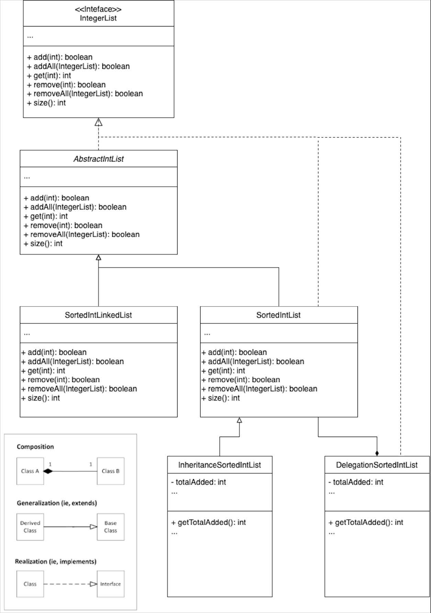

# Lab 5: Inheritance and Composition

## Concepts
**Inheritance vs Composition:**
+ Inheritance: Allow one class (Child class) inherits attributes and behaviors from another class (Parent class), promoting code reusability.
+ Composition: One class reuses functionality from another class through its public interface, which reduces coupling. 

## Deliverables
- [ ] Create a subclass of SortedIntList with inheritance that counts how many elements have been added to the list. 
- [ ] Create a class that wraps a SortedIntList using a decorator to count how many elements have been added to the list.
- [ ] Discuss questions regarding the tradeoffs and limitations between inheritance and composition with a TA (no written answer needed).

## Instructions

### Setup
<u>Fork</u> and clone the repo from [https://github.com/CMU-17-214/s24-lab05](https://github.com/CMU-17-214/s24-lab05)

## Task Overview
You will examine the strengths and weaknesses of inheritance and composition by using both techniques to add a feature to a ```SortedIntList``` class. The ```SortedIntList``` class is one of a family of integer lists. It is very similar to the  ```AbstractIntList```, except it stores its elements in ascending order.

We want to instrument a ```SortedIntList``` to count how many elements have been added since it was created. (This is not the same as its current size, which is reduced when an element is removed). To provide this functionality ```getTotalAdded```, you should count the number of attempted insertions and also provide an access method to get this count. Your solutions should use inheritance and composition so you can reuse, but not modify, the original ```SortedIntList``` implementation. Please refer to the appendix for the UML diagram. 


### Task 1: Instrumentation with inheritance
We have provided an empty ```InheritanceSortedIntList``` class where you should implement an inheritance-based solution. 
    
> Hints: 
> + ```InheritanceSortedIntList``` should extend ```SortedIntList```. 
> + The ```SortedIntList``` contains two methods that add elements, ```add``` and ```addAll```. 
> + You should override both of these methods to track how many elements have been added.
> + Make sure you check that ```getTotalAdded``` works with both ```add``` and ```addAll```.

After you have implemented the ```InheritanceSortedIntList``` class, test the instrumentation you just added using tests in ```InheritanceSortedIntListTest``` class. 

### Task 2: Instrumentation with composition:
We have provided an empty ```DelegationSortedIntList``` class where you should implement your composition-based solution.

> Hints: 
> + Ensure your class implements the ```IntegerList``` interface.
> + Create a private ```SortedIntList``` instance to which you will delegate list-storing functionality.
> + Forward list operations to the ```SortedIntList``` instance.
> + Make sure you check that ```getTotalAdded``` works with both ```add``` and ```addAll```.
> + After you have implemented the ```DelegationSortedIntList``` class, test the instrumentation you just added using tests in ```DelegationSortedIntListTest``` class. 


Run the tests and make sure your instrumentation passes all the tests. 
(You might want to use the ```printList``` helper we provided you and read the documentation for ```addAll``` in the ```AbstractIntList``` class.) 

### Task 3: Questions on Composition and Inheritance 
Evaluate your two implementations for the given problem and answer the following questions:
1. Which is more dependent on the implementation details of the ```SortedIntList```, composition or inheritance?
2. If the ```add``` method in ```SortedIntList``` is significantly modified or its behavior changes, which implementation is more likely to break?
3. What issues does using composition solve that might have been problematic with inheritance?
4. Based on the provided implementations, when would it be more appropriate to use inheritance and when to use composition?


## Appendix
Take a look at the UML diagram to see what each function should implement.



