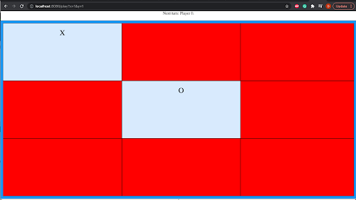
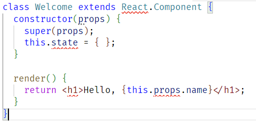
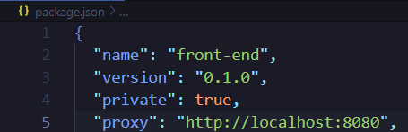
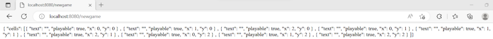
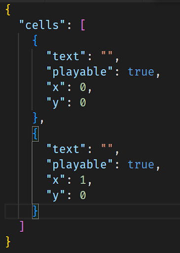

# Lab 10: TicTacToe Client/Server

## Context
TicTacToe is a two-player game where the players take turns marking the spaces in a three-by-three grid with either X or O. The first player to place three of their marks in a horizontal, vertical, or diagonal row is the winner. More information about the game can be found [here](https://en.wikipedia.org/wiki/Tic-tac-toe). In this recitation, you will work on an implementation of the TicTacToe game.

This version of TicTacToe is meant to help you set up Homework 6a (User Interface for santorini). It uses a Java backend using a NanoHttpd server and a TS frontend using React.js. This client/server style architecture is commonly used in developing web applications. However, this is a very big topic, we will only cover the essentials for this lab and Homework 6.

## Deliverables
- [ ] Extend the implementation to show the current player and winner of the game in the “instructions” panel of the game.
- [ ] Extend the implementation of the game to allow users to undo steps.
- [ ] Change the styling of the game with CSS files (e.g., change colors).

## Instructions
Clone the TicTacToe repository from: https://github.com/CMU-17-214/s24-rec10

Refer to the README’s of the projects therein for set up instructions. After you run the program, you will be able to play the game through the GUI as illustrated in the snippet below from the link http://localhost:3000/.

Today’s recitation is all about learning to read and navigate this type of code. The deliverables require you to implement a few very simple improvements, that won’t take you much time at all once you get the hang of how the code is written and structured. So prioritize reading the code and thinking about the flow of information and control.

Instructions: Right now, the game doesn’t tell the user much; once someone has won, it just stops responding. Let’s add an “instructions” element to the HTML body, with the ID “instructions”. The CSS for this element is already present. The text in this element should indicate whose turn it is, or who has won the game (if applicable). Hint: think about all the places affected by this, in terms of client/view (HTML), and server/controller. How do other elements get updated?

Undo: The “Undo” button currently does nothing at all. Let’s wire it up. Much like in the previous exercise, think about all the places where changes need to be made. This one will also require you to get into the game implementation (the model), where most of the functionality needed to facilitate `undo` (tracking a game’s history) is already present. Note that this is strongly supported by the immutable implementation of the game. Again, follow the control flow from the user clicking to (and within) the backend, and back. Use the “history” to implement undo on the game implementation side.

Styling: Make it pretty! You can either expand on the CSS provided -- maybe move it to its own file(s) -- or bring in themes.

### Hint: Key Files
To work with this TicTacToe font-end and back-end implementation, you mainly need to understand 4 files:
App.tsx: the main component of this React project.
App.css: the CSS style file for the application.
Cell.tsx: the React.js component for rendering a cell of the board. You may also define a new style file for the Cell component.
game.ts: it defines the data structure for the game including the GameState and the Cell. These structures should likely match with the data structures defined in your backend.

### Hint: Connecting the Frontend to the Backend
This program already has the frontend connected to the backend for you.  How this works is that within the Java backend, nanohttpd sets up a server that runs at http://localhost:8080/.  It also sets up two pages, /newgame for creating a new game and /play to play a certain move. Then within the TS frontend, which React hosts at http://localhost:3000/, which is where you should redirect your page to, whenever you go to the /newage or /play pages, a request is sent to the nanohttpd server with the relevant info. The server then responds to React with a JSON, with the updated cells.

## HTML/CSS Review
HTML is the standard markup language for Web pages. It is very similar to XML. CSS is the language we use to style an HTML document. CSS describes how HTML elements should be displayed and looked like. There are a lot of good online resources for learning HTML and CSS, e.g., HTML Tutorial (https://www.w3schools.com/html/default.asp) and CSS Tutorial (https://www.w3schools.com/css/default.asp). Please read them if you are not familiar with these materials.

## Nanohttpd Review
Nanohttpd is a lightweight Java server that is good for very basic web applications.  Because of how small and lightweight it is, it is good for embedding into already existing applications without adding too much size or latency to the project.  The backend server of this game is built upon it. To learn more about it, please refer to this Nanohttpd Tutorial (https://www.baeldung.com/nanohttpd).

## React.js Review
React.js is a Javascript framework that can be adjusted to work for TypeScript. It is mainly used to make very interactive and dynamic UIs.  It allows you to create a complex UI using smaller, isolated pieces of code called “components”. We will use the most basic part of React.js.

### A Little History, Why React.js
Stage 1, at the very beginning, most resources shared on the internet were static, i.e., engineers can use HTML to define their static web pages. They could simply update the HTML files (at the server backend) to change the content they wanted to share. However, the webpage has limited interactivity and cannot load data dynamically after being rendered by the browser.
Stage 2, browsers now support Javascript. Engineers can now use Javascript to change their webpages on the client side (browser) to, e.g., add animation, and load data dynamically. E.g., you may find a website that will dynamically update the items as you scroll down the page.
Stage 3, most of the websites are still relying on the technique in Stage 2, even React.js. However, some old Javascript frameworks require you to manually load the data and add/delete HTML elements. This is painful and tedious when your webpage is highly interactive and dynamic. Thus, frameworks like React.js are created. You can easily bind your data and code with the HTML element, and the framework will automatically update the view.

### Component
Components are a key element of React.js projects. Each component defines 1) the HTML element about how you want to visualize your data, 2) data bound with this component, e.g., a component is used to render the board, so it should associate with the board data, 3) the code logic for how the data and view will dynamically change or respond to user input. Thus, we can break the web application into small pieces (components), each with its own view definition, data, and implementation.

A very simple component could look like:

Each component will have:
props, an object passed from the caller that holds the data of this component, e.g., in the example, we assume that the parent component of Welcome will pass in the name of this Welcome component instance, which the name will be stored in props, so we can access the name using this.props.name;
state, an object managed by the component itself that can also hold the data of the component, we can use setState() function to update its value, and the view will automatically update accordingly;
render(), the function you must implement which defines how the component will be rendered. In React.js, we use JSX (https://legacy.reactjs.org/docs/introducing-jsx.html) to directly define HTML as code in Javascript or Typescript. In the example, we create a tag, and the name is dynamically obtained from the `this.props.name` object. An advantage of React is that, when the value of name is changed, the view will automatically update.

Some notes:
props should not be changed by the component itself but instead will be changed by its parent component. On the other hand, state is usually the internal data of the component which should be managed by the component itself.
constructor(props) is not necessary for a component. The only needed one is the render() function

### Proxy
One thing this lab makes use of is a TypeScript property called proxy. Proxy essentially tells the front end to route all connections to the base url given in the package.json.  For this assignment, the proxy routes to http://localhost:8080/, which is the url that the backend server is running on. This means that when we have a command like await fetch(“/newgame”), this will send a GET request to http://localhost:8080/newgame. 

### JSON
JSON (JavaScript Object Notation) is a way of formatting data to be easily stored and read by humans. This is similar to a dictionary object with keys and values.  An example JSON object is shown below:

This is the format of the information sent from the backend to the frontend. 