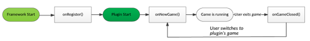

# Lab 11 - Introduction to Frameworks

Repo link: https://github.com/CMU-17-214/s24-rec11

In this recitation, you will create a TicTacToe plug-in for a simple framework that facilitates the implementation of 2D grid games. To make grid game development straightforward, the game plugins must only implement the game’s logic. Everything else (plug-in registration, player management, GUI implementation, etc.) is done by the framework. We hope that this provides a good illustration for the kind of extension mechanisms that may be useful for implementing other extensible systems (e.g., Santorini God Cards).

## Deliverables
- [ ] Implement a simple Tic-Tac-Toe plugin, in either Java or TypeScript, and register it with the framework.
- [ ] Discuss what the extension points are in this system and explain why to your TA.
- [ ] Discuss what design pattern is being used here with your TA.

## Introduction
A framework provides a set of common functionalities that can be used by plug-ins to build applications. These functionalities typically include:
- A set of predefined functions or classes that can be used to perform common tasks, such as database access, input validation, and session management.
- A set of rules or conventions that dictate how code should be structured and organized within the framework.
- A set of APIs that plug-ins can use to interact with the framework and other plug-ins.

On the other hand, plug-ins are responsible for implementing specific features or functionality that are not provided by the framework. This can include things like custom user interfaces, business logic, or integration with third-party services. Plug-ins may also be responsible for making certain decisions about how the application should function or behave, such as which database to use or how to handle errors.

## The Framework
The core implementation of the framework is located in the core package/directory, a GamePlugin interface, and a GameFramework interface defining the methods Plugins can call on the framework. Grid game plug-ins must implement the GamePlugin interface in order to be registered with the framework. The GamePlugin interface contains several lifecycle methods that are called at various times throughout the period of a game (see the figure below). It also has a few getter methods that the framework will call to obtain the name of the plug-in game, the width/height of the plug-in game’s board, etc.



Two example plug-ins, “Rock-Paper-Scissors” (a classic grid-based game, seriously) and “Memory”, are already implemented for you in the plugin package/directory. You can start backend and frontend, and then go to http://localhost:3000 to see the behavior.

## Instructions
Read the given framework implementation to familiarize yourself with what it provides you, the sample plug-ins to see how you can implement your own plugin, and the documentation for the GamePlugin interface.

Implement a simple TicTacToe plugin in the plugin package/directory. We have provided you with an implementation of the game TicTacToe in the games package/directory, which you can use in your plugin implementation.

To register your plugin with the framework, add the fully-qualified class name of your plugin to the edu.cmu.cs.cs214.rec11.framework.core.GamePlugin file in the src/main/resources/META-INF/services/ directory; in App.java, a method called loadPlugins() will use java.util.ServiceLoader which will then use Java reflection to instantiate your plug-in and register it with the framework. 

An implementation completely in TypeScript is provided to you in the typescript branch. Check out the code in src/pluginloader.ts to see how to load plugins in Typescript. Any .js file in the plugin directory is loaded (files created by the compiler from .ts files work fine). If it exports a method “init()” that method is called and expected to return an object implementing the GamePlugin interface. The loading code is fairly straightforward using promises.

### Set Up Java ###
Either run the Java backend by using your IDE or by typing 
```
mvn exec:exec
```
in the backend folder. This will start the Java server at http://localhost:8080.

### Set Up Typescript ###
In the frontend folder, run

```
npm install
npm start
```

This will start the frontend server at http://localhost:3000. You can update the frontend code as the server is running in the development mode (i.e., npm start). It will automatically recompile and reload.
